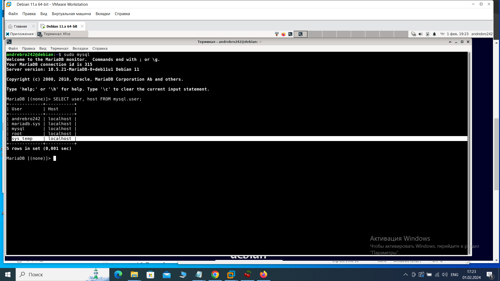
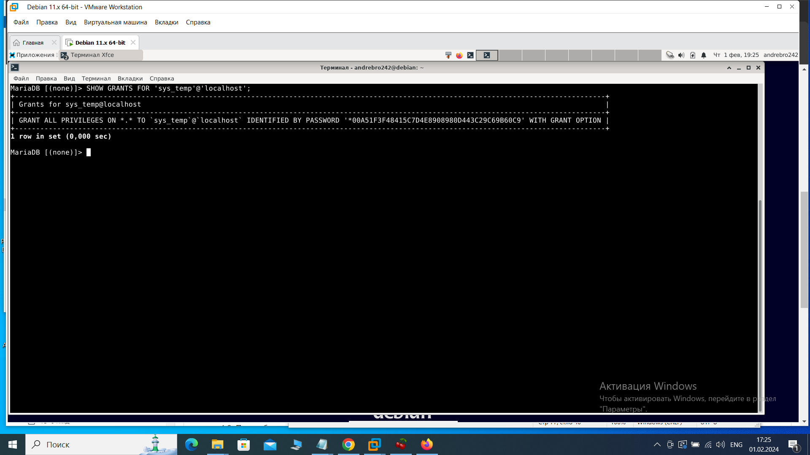
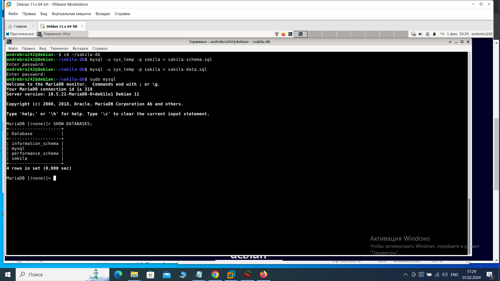
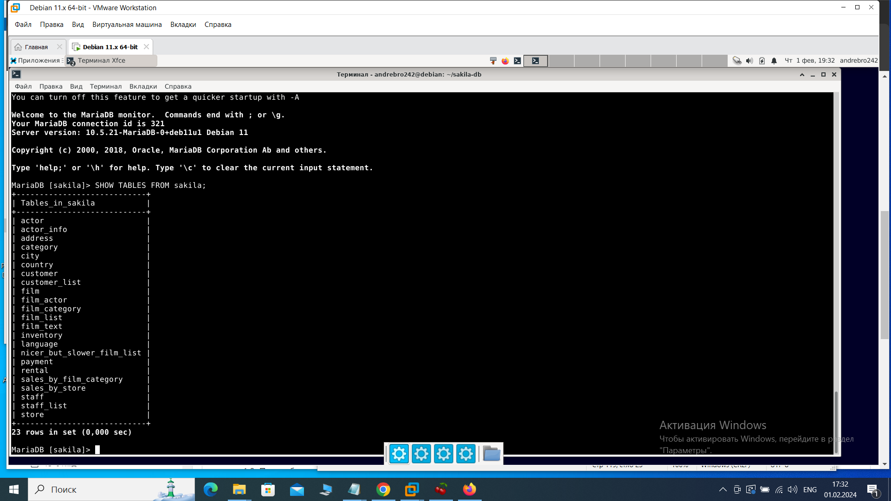
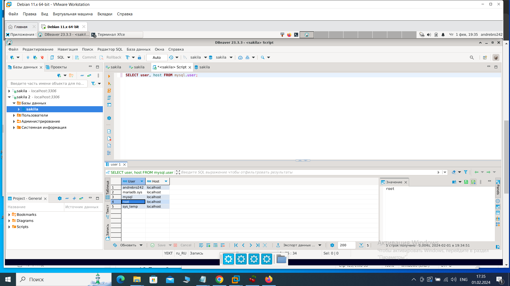
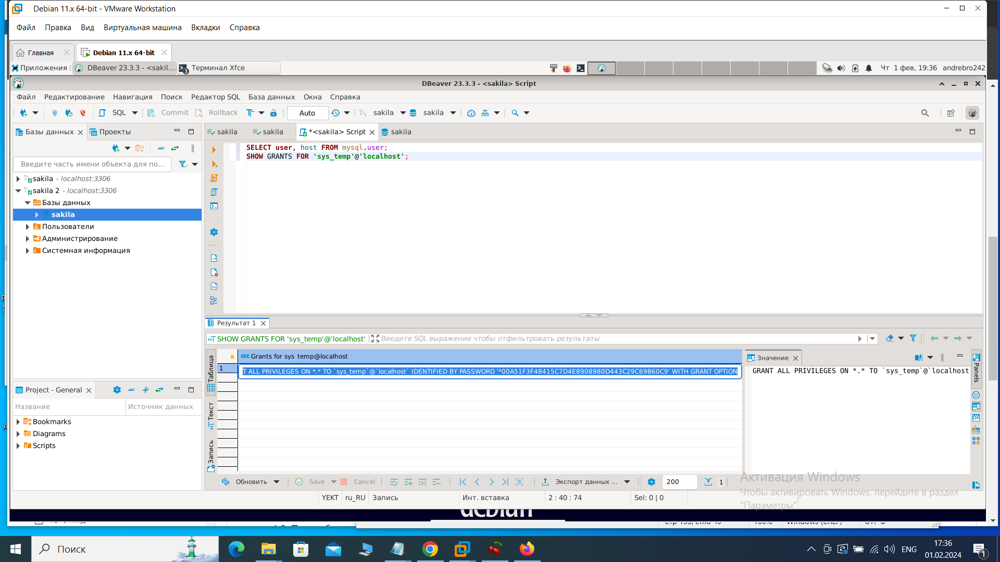
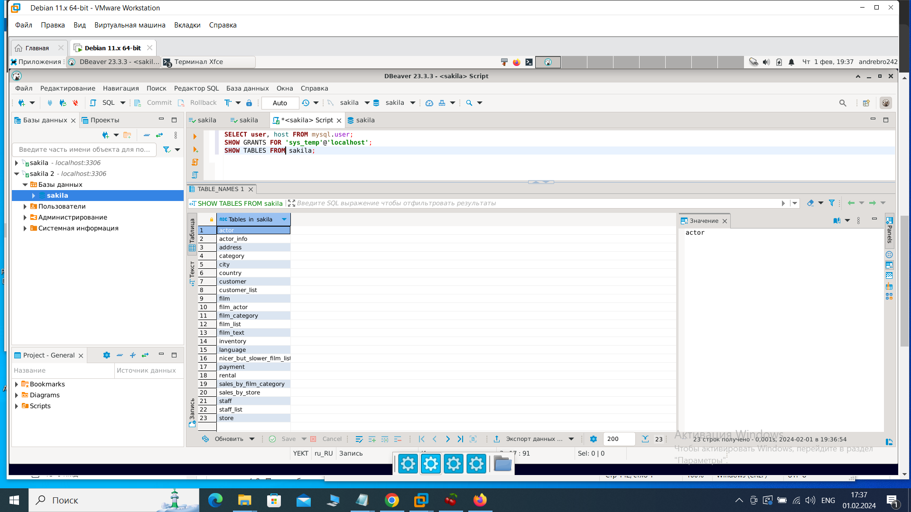
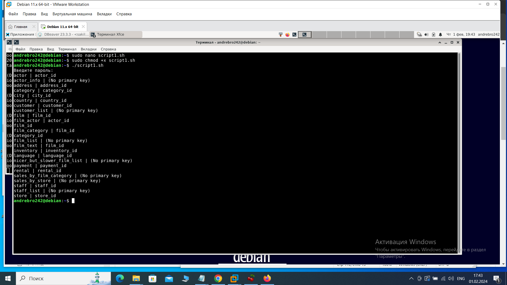
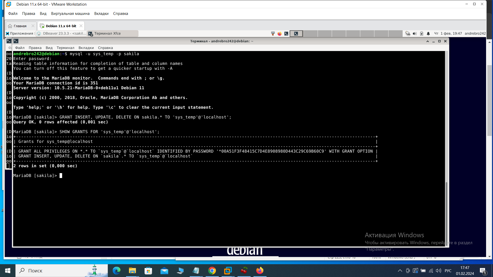

Домашнее задание к занятию «Работа с данными (DDL/DML)» Брюхов А SYS-26

Задание 1

1.1. Поднимите чистый инстанс MySQL версии 8.0+. Можно использовать локальный сервер или контейнер Docker.

1.2. Сделайте учётную запись sys_temp.

1.3. Выполните запрос на получение списка пользователей в базе данных. (скриншот)

1.4. Дайте все права для пользователя sys_temp.

1,5. Выполните запрос на получение списка прав для пользователя sys_temp. (скриншот)

1.6. Переподключитесь к базе данных от имени sys_temp.

Для смены типа аутентификации с sha2 воспользуйтесь запросом:

ALTER USER 'sys_test'@'localhost' IDENTIFIED WITH mysql_native_password BY 'password';

1.6. По ссылке https://downloads.mysql.com/docs/sakila-db.zip скачайте дамп базы данных.

1.7. Восстановите дамп в исходных данных.

1.8. При работе в IDE сформируйте ER-диаграмму полученной базы данных. При работе в командной строке используйте команду для получения всех таблиц баз данных. (скриншот)

Результатом работы должны быть скриншоты графических заданий, а также простота со всеми запросами.

Решение 1

1.1 установил MariaDB:

    sudo apt install mariadb-server

Запустил службу MariaDB:

    sudo systemctl start mariadb

Добавил MariaDB в автозапуск:

    sudo systemctl enable mariadb

Установил пакет dbeaver-ce_23.3.3_amd64.deb на Debian 11

Перешел в каталог, где находится файл deb:

    cd ~/dbeaver

Затем выполнил команду dpkg для установки пакета:

    sudo dpkg -i dbeaver-ce_23.3.3_amd64.deb

(если при установке возникникли ошибки из-за недостающих зависимостей:
    sudo apt-get install -f
Эта команда автоматически установит недостающие зависимости. )

1.2 Зашел в MariaDB с правами sudo:

    sudo mysql

Создал пользователя sys_temp и предоставил ему все необходимые привилегии:

    CREATE USER 'sys_temp'@'localhost' IDENTIFIED BY '12345';

    GRANT ALL PRIVILEGES ON *.* TO 'sys_temp'@'localhost' WITH GRANT OPTION;

    FLUSH PRIVILEGES;

1.3. Выполнил запрос на получение списка пользователей в базе данных. 

    SELECT user, host FROM mysql.user;

1.4.Выполнил в пункте 1.2.

1.5. Выполнил запрос на получение списка прав для пользователя sys_temp.

    SHOW GRANTS FOR 'sys_temp'@'localhost';

1.6.Распаковал базу данных:

    unzip sakila-db.zip

Открыл MariaDB-клиент и создал базу данных Sakila:

    mysql -u sys_temp -p

    CREATE DATABASE sakila;

    EXIT;

1.7.Восстановил схему и данные Sakila:

    cd ~/sakila/sakila-db
    mysql -u sys_temp -p sakila < sakila-schema.sql
    mysql -u sys_temp -p sakila < sakila-data.sql

Проверка, что база данных Sakila создана:

    sudo mysql

В MariaDB-клиенте:

    SHOW DATABASES;

вижу базу данных sakila в списке.

подключился к базе данных Sakila:

    mysql -u sys_temp -p sakila

Если успешно подключился, увижу приглашение MariaDB для базы данных Sakila.

1.8.команда для получения всех таблиц базы данных:

    SHOW TABLES FROM sakila;

запустил DBeaver:

    dbeaver

выполняю запрос на получение списка пользователей

    SELECT user, host FROM mysql.user;

Выполняю запрос на получение списка прав для пользователя

    SHOW GRANTS FOR 'sys_temp'@'localhost';

для получения всех таблиц баз данных.

    SHOW TABLES FROM sakila;

Задание 2
Составьте таблицу, используя любой текстовый редактор или Excel, в которой должно быть два столбца: во-первых, должно быть название таблицы восстановленной базы, во-вторых, название первичных ключей этих таблиц. Пример: (скриншот/текст)

Название таблицы | Название первичного ключа
customer         | customer_id

Решение 2

1.Для получения выполнения задания создал скрипт script1.sh :

#!/bin/bash

    # Запрос пароля один раз
    read -s -p "Введите пароль: " password
    echo
    # Использование пароля в цикле
    mysql -u sys_temp -p$password sakila -N -e "SHOW TABLES" | while read -r table; do
      echo -n "$table | "
      primary_key=$(mysql -u sys_temp -p$password sakila -N -e "SELECT COLUMN_NAME FROM INFORMATION_SCHEMA.COLUMNS WHERE TABLE_SCHEMA='sakila' AND TABLE_NAME='$table' AND COLUMN_KEY='PRI'")
      if [ -z "$primary_key" ]; then
        echo "(No primary key)"
      else
        echo "$primary_key"
      fi
    done

sudo chmod +x script1.sh

./script1.sh

получил :

Составил таблицу :

    +-----------------------------+---------------------------+
    | Название таблицы            | Название первичного ключа |
    +-----------------------------+---------------------------+
    | actor                       | actor_id                  |
    | actor_info                  | (No primary key)          |
    | address                     | address_id                |
    | category                    | category_id               |
    | city                        | city_id                   |
    | country                     | country_id                |
    | customer                    | customer_id               |
    | customer_list               | (No primary key)          |
    | film                        | film_id                   |
    | film_actor                  | actor_id, film_id         |
    | film_category               | film_id, category_id      |
    | film_list                   | (No primary key)          |
    | film_text                   | film_id                   |
    | inventory                   | inventory_id              |
    | language                    | language_id               |
    | nicer_but_slower_film_list  | (No primary key)          |
    | payment                     | payment_id                |
    | rental                      | rental_id                 |
    | sales_by_film_category      | (No primary key)          |
    | sales_by_store              | (No primary key)          |
    | staff                       | staff_id                  |
    | staff_list                  | (No primary key)          |
    | store                       | store_id                  |
    +-----------------------------+---------------------------+

Задание 3*
3.1. Выберите у пользователя sys_temp права на внесение, изменение и удаление данных из базы данных sakila.

3.2. Выполните запрос на получение списка прав для пользователя sys_temp. (скриншот)

Результатом работы должны быть скриншоты графических заданий, а также простота со всеми запросами.

Решение 3

Чтобы предоставить пользователю sys_temp права на внесение, изменение и удаление данных из базы данных sakila :

    GRANT INSERT, UPDATE, DELETE ON sakila.* TO 'sys_temp'@'localhost';

Чтобы получить список прав для пользователя sys_temp :

    SHOW GRANTS FOR 'sys_temp'@'localhost';

 

